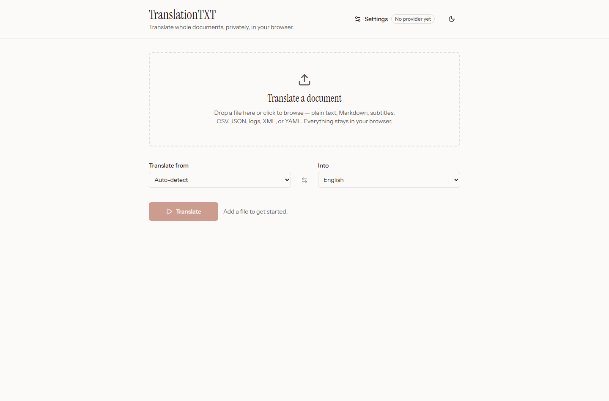
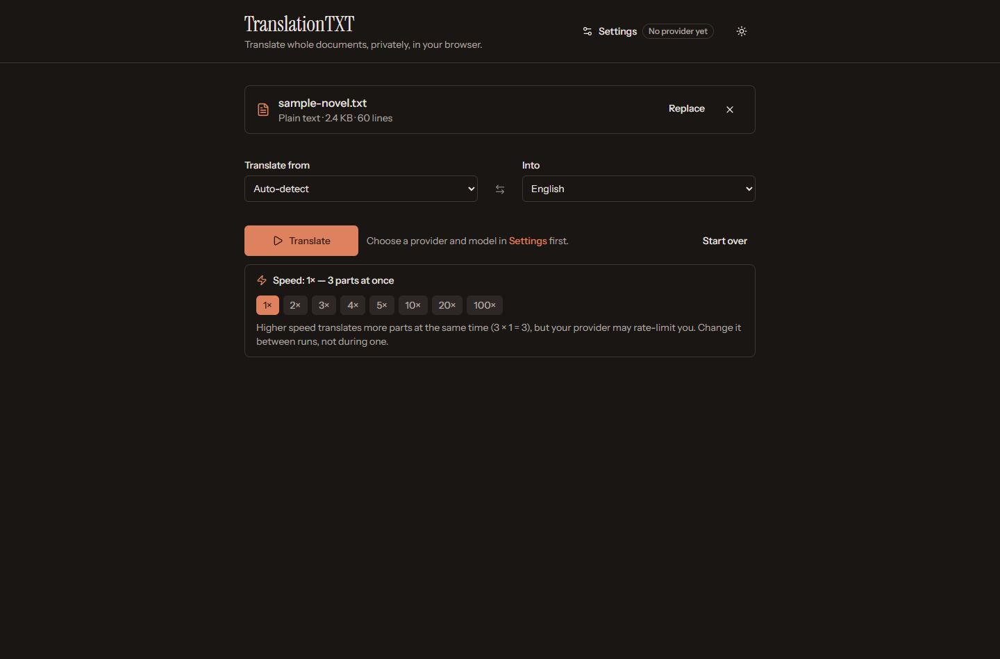
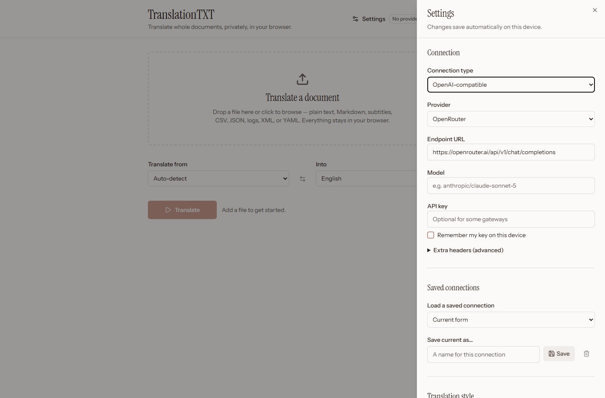

# TranslationTXT

Client-side translation workspace for text and structured text files using OpenAI-compatible, Anthropic-compatible, and Google Gemini endpoints. Everything runs in your browser — your files and API keys never touch a server of ours.

## Screenshots

|  |  |
|---|---|
|  |  |
| *Single-page flow — drop a file, pick a language pair, translate* | *Warm editorial dark theme with the speed control* |


*Settings slide over the page; every change saves automatically on your device*

## Features

- **Single-page flow**: Drop a file → pick a language pair → Translate → watch progress → download. Technical controls live in a separate Settings panel.
- **Multi-format support**: TXT, CSV, Markdown, JSON, logs, SRT, VTT, XML, YAML
- **Multiple providers**: OpenAI-compatible (OpenRouter, DeepSeek, Fireworks, xAI, MiniMax, OpenAI), Anthropic-compatible (Anthropic, DeepSeek), Google Gemini
- **Smart chunking**: Automatic chunking with overlap for large files, plus a 1×–100× speed control for parallel translation
- **Novel mode**: Specialized handling for long-form fiction translation
- **Partial output**: Download, copy, or preview what's translated so far even before a run finishes
- **Local-first**: All processing happens in your browser
- **PWA support**: Works offline after initial load

## Getting Started

```bash
# Install dependencies
npm install

# Start development server
npm run dev

# Build for production
npm run build

# Preview production build
npm run preview

# Run tests
npm test
```

## Tech Stack

- React 19 + TypeScript 6
- Vite 8
- Tailwind CSS 4 (CSS-first config)
- Radix UI primitives (shadcn-style components)
- Vitest
- PWA with Service Worker

## License

MIT
